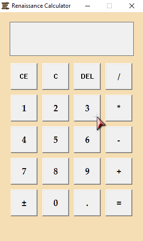

# 🏛 Renaissance Calculator

**Renaissance Calculator** is a simple yet stylish Windows calculator built with C++ and WinAPI. It supports basic arithmetic operations, includes functions for clearing and deleting characters, and allows working with computed results. Inspired by the Renaissance era, this project blends a classic aesthetic with modern functionality.

---

## ✨ Features

- 🔢 **Basic Arithmetic** – Perform addition, subtraction, multiplication, and division.
- ♻️ **CE (Clear Entry)** – Clears only the last entered number.
- 🗑 **C (Clear All)** – Resets the entire input and calculation.
- ⌫ **DEL (Delete Last Digit)** – Removes the last entered character.
- 🔄 **Sign Toggle (±)** – Switch between positive and negative values.
- 🔢 **Decimal Support (.)** – Allows input of fractional numbers.
- 📊 **Result Processing** – Continue calculations using the displayed result.

---

## 📸 Screenshot


---

## 🚀 Quick Start

1. Clone the repository and compile the program:
   ```bash
   g++ -o RenaissanceCalculator RenaissanceCalculator.cpp -lm
   ```

2. Run the application:
   ```bash
   ./RenaissanceCalculator
   ```

3. Use the menu to:
   - **1**: Perform basic arithmetic calculations.
   - **2**: Clear the last entry (CE).
   - **3**: Clear all inputs (C).
   - **4**: Delete the last digit (DEL).
   - **5**: Toggle the sign (±).
   - **6**: Exit the application.

---

Happy calculating! 🎯
