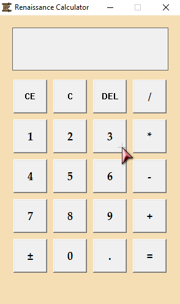

# 🏛 Renaissance Calculator

**Renaissance Calculator** is a lightweight and elegant calculator for Windows, built using modern C++ and the classic WinAPI. Inspired by the artistic legacy of the Renaissance era, this app blends a warm aesthetic with solid functionality.

> ✨ Designed for simplicity. Styled with character.

---

## ✨ Features

| Feature               | Description                                                    |
|-----------------------|----------------------------------------------------------------|
| ➕➖✖️➗ Basic Math       | Perform addition, subtraction, multiplication, and division.  |
| ♻️ CE (Clear Entry)    | Clears only the last entered number.                          |
| 🗑 C (Clear All)       | Resets the entire calculation and display.                    |
| ⌫ DEL (Delete)        | Deletes the last entered character.                           |
| 🔁 ± (Sign Toggle)    | Switch between positive and negative values.                  |
| 🔢 Decimal Support     | Add floating-point numbers using the dot (.) button.          |
| 📊 Result Chaining     | Use result from previous operations in new expressions.       |

---

## 🖼️ Screenshot



---

## ⚙️ How to Build

1. Clone this repository:

   ```bash
   git clone https://github.com/your-username/renaissance-calculator.git
   cd renaissance-calculator
   ````

2. Open the project in **Visual Studio Code** with the **C++ extension** installed.

3. Compile & Run:

   * Open `main.cpp`
   * Press `Ctrl + Shift + B` to build
   * Press `F5` to run

> 💡 Make sure you’re compiling as a **Windows GUI app** (`WinMain`) and using `g++` or MSVC with WinAPI support.

---

## 📁 Project Structure

```
renaissance-calculator/
├── media/                  # Icons, cursors, and visuals
│   ├── calculator_icon.ico
│   └── normal.cur
├── images/                 # Screenshots
│   └── screenshot.png
├── calculator.h            # Declarations and global state
├── calculator.cpp          # UI logic and event handling
├── main.cpp                # WinMain and window setup
└── README.md
```

---

## 🛠 Tools & Technologies

* C++17 with WinAPI
* Visual Studio Code or Visual Studio
* Windows 10+ (x64 recommended)
* Custom cursor & icon support
* Palatino Linotype font styling

---

## 🧑‍💻 License

This project is licensed under the [MIT License](LICENSE).
Feel free to explore, fork, and contribute!

---

## 🚀 Roadmap & Ideas

- Add keyboard support
- Sound feedback on button press
- Light/dark mode toggle
- Switch layout to scientific calculator

Stay tuned! 📐🧮

